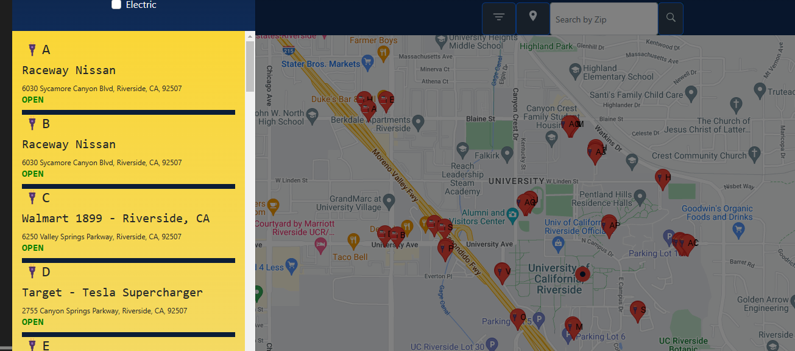

# Gas N'Charge

## Description

Gas N'Charge is a map integrated map with intention to help EV or ICE driver find station to charge or fill up their ride. The app was made to simplify the process or search and use it of the go when time is precious.  

## Table of Contents

- [Usage](#usage)
- [Features](#features)
- [Credits](#credits)

## Usage

User can find the original deployed app at [Gas N'Charge](https://gasncharge.herokuapp.com/)

Repo for original app can be found at: (https://github.com/jchavez12305/Gas-Electric)

## Features 
- Users can create an account using secure registration and login.
- User can use their location or enter a zipcode to search the area of interest. 
- User can filter search bt either gas or electric. 

*** IN DEVELOPMENT ***
- Ability to add and delete favorite stations. 
- Optimize search criteria and accuracy of current info. 

## Credits

Contributors: 
Dominguez, Robert  
Gomez, Christopher  
Sitnitski, Stan  
Yoon, Gi Won  
Chavez, Juan 
 
 

## Technologies Used:
- React
- GraphQL
- [NREL API](https://developer.nrel.gov/docs/transportation/alt-fuel-stations-v1/all/)
- [Google API](https://developers.google.com/maps/documentation/javascript/supported_types)
- MangoDB
- Bootstrap

## Screenshots
